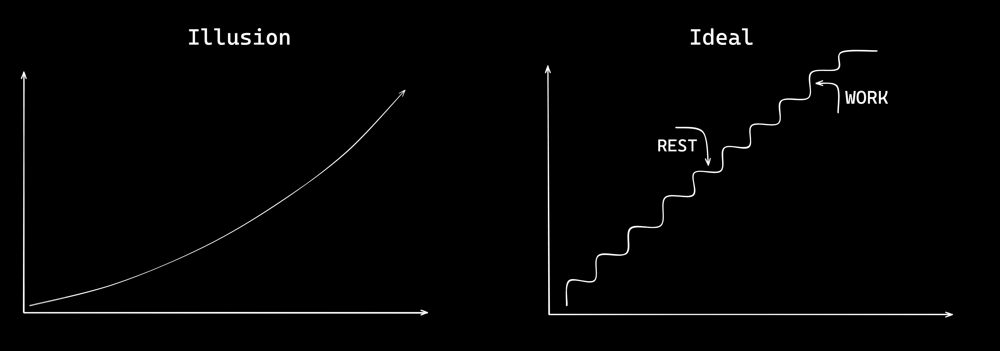

# Your Tech Career Should be Like a Motorsport
**a parallel between your learning process and Formula One**

## Intro

Last weekend, while watching videos of race highlights from the 2021 Abu Dhabi Grand Prix (Max Verstappen fan detected), I found myself motivated by my ongoing habit of writing tech articles. This led me to ponder the idea of tracing similarities between motorsport and the learning journey in computer science. I asked myself, 'Why not?' So, I began drawing this parallel.

I just realized that embarking on the road of learning computer science can be easily linked to many motorsport characteristics. Both paths are filled with twists, turns, and the occasional need for technology improvements. In this article, we'll explore how certain principles of motorsport can be applied to optimize your learning process and career evolution.

## Pit Stops and Maintenance

Just as racers strategically make pit stops to maintain their vehicles, learners should recognize the importance of breaks in the learning process. There are many reasons that make people say computer science can be really overwhelming and can cause burnouts. These pauses allow you to absorb the content better, reflect on your progress, and make adjustments to study strategies. Consider these breaks as opportunities to fine-tune your learning engine for reaching the best performance you can.

## Adaptability and Course Correction

In both motorsport and tech careers, unexpected challenges arise. The ability to adapt and course-correct is crucial. Just as a racer adjusts to changes on the track, software developers must be ready to pivot their strategies when facing difficulties. In my previous article, I talked about one of them, explaining a bit about [Rabbit Holes.](https://dev.to/gabriel-palhares/rabbit-holes-and-when-to-avoid-them-4dae) However, there's a lot more that people often forget when they're making plans. Your career and learning process are not a straight and ascending line; it's actually a lot of ups (through work) and downs (which you can manage and avoid with rest). Embrace challenges as opportunities to refine your skills and improve your overall performance on your learning curve.

## Teamwork and Collaboration

Motorsport teams exemplify the power of collaboration, and the same holds true in the world of computer science. Have you ever heard about [Learn In Public?](https://www.swyx.io/learn-in-public) The logic behind Learn In Public relies into the open-source culture, and its motto is to learn faster than privately learning. Although Swyx (Shawn Wang) is not the founder of the idea, he’s one of the most popular advocates of it. He describes LIP as follows:

> **You share what you learn, as you learn it. You open-source your knowledge. You build a public record of your interests and progress, and along the way, you attract a community of mentors, peers, and supporters. They will help you learn faster than you ever could on your own. Your network could be vast, consisting of experts in every field, unconstrained by your org chart.” - The Coding Career Handbook.**

Seek guidance, learn from peers, and foster a sense of community within your learning process. Collaborative efforts can lead to accelerated progress and the discovery of innovative solutions to complex problems. It’s your journey, but with the knowledge shared in community, you can drive further.

## Setting Goals and Milestones

Just as racers aim for specific lap times or podium finishes, set realistic goals and milestones in your journey. Nobody won a grand prix without training, studying the track, and planning how to achieve the fastest lap first. Achieving smaller milestones contributes to overall progress and keeps you motivated. Instead of aiming for one big and specific goal, break it into smaller objectives. Map out your learning route, and celebrate each milestone as a step closer to mastering your stack or achieving your dream job.

## Endurance and Long-Term Commitment

Endurance is a shared trait between motorsport athletes and learners. In this context, focus on one thing: View the learning journey and your career as a marathon rather than a sprint. The winner of the race isn't determined by the car that reaches the maximum speed, but rather by the one that completes the lap more efficiently and consistently. It's about being fast when necessary, executing proper gear shifts, slowing down when required, and changing tires at the right moment. All of these aspects can be associated with endurance and a long-term strategy. Understand that setbacks are part of the journey, and staying committed to your goals is essential - day by day.

## Finish Line

These are the lessons that explain why your tech career should be like a motorsport - taking strategic pit stops, embracing adaptability, leveraging teamwork, mastering skills, setting ambitious goals, and cultivating endurance. As you rev your engines by incorporating these ideas, I believe you'll navigate the twists and turns of the learning process in a tech career with finesse. Consistent effort, coupled with a long-term perspective, ensures that you'll cross the finish line.

---

Cover photo by [Maria Geller](https://www.pexels.com/pt-br/@maria-geller-801267/), taken with an ILCE-7M3.
