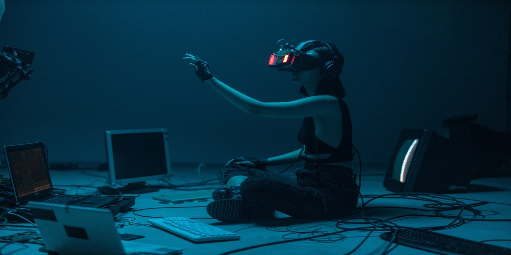

# Personal lists

### People I admire and inspire me

- My Father
- [Armando Magalhães](https://x.com/armand1m)
- [Sibelius Seraphini](https://x.com/sseraphini)
- [Laura Beatris](https://x.com/lauradotjs)
- [Beatriz Oliveira](https://x.com/biantris_)
- [Vitor Liberato](https://x.com/vitorliberato)

### Books

- [O segredo maior do mundo](https://www.goodreads.com/book/show/87265306-o-segredo-maior-do-mundo?ac=1) - Sayaru
- [O fim da eternidade](https://www.goodreads.com/book/show/509784.The_End_of_Eternity) - Isaac Asimov
- [Uma breve história do tempo](https://www.goodreads.com/book/show/3869.A_Brief_History_of_Time) - Stephen Hawking
- [A revolta de Atlas](https://www.goodreads.com/book/show/9555414-a-revolta-de-atlas) - Ayn Rand
- [A lógica do Cisne Negro](https://www.goodreads.com/book/show/5113684-a-l-gica-do-cisne-negro) - Nassim Nicholas Taleb
- [Anti-frágil: Coisas que se beneficiam com o caos](https://www.goodreads.com/book/show/13530973-antifragile) - Nassim Nicholas Taleb

### CS Books

- [Introduction to Algorithms](https://www.goodreads.com/book/show/108986.Introduction_to_Algorithms) - Thomas H. Cormen
- [The pragmatic programmer](https://www.goodreads.com/book/show/4099.The_Pragmatic_Programmer) - Andrew Hunt, Dave Thomas
- [JavaScript: The Good Parts](https://www.goodreads.com/book/show/58699495-javascript) - Douglas Crockford
- [Effective TypeScript](https://www.goodreads.com/book/show/48570456-effective-typescript) - Dan Vanderkam
- [SICP](https://www.goodreads.com/book/show/43713.Structure_and_Interpretation_of_Computer_Programs) - Harold Abelson, Gerald J. Sussman
- [Crafting Interpreters](https://www.goodreads.com/book/show/58661468-crafting-interpreters) - Robert Nystrom
- [Designing Data-Intensive Applications](https://www.goodreads.com/book/show/23463279-designing-data-intensive-applications) - Martin Kleppmann
- [The Mythical Man-Month](https://www.goodreads.com/book/show/13629.The_Mythical_Man_Month) - Frederick P. Brooks Jr.

### Movies worth watching

- [Fantastic Mr. Fox](https://www.imdb.com/title/tt0432283/?ref_=ext_shr_lnk) - Wes Anderson
- [Whiplash](https://www.imdb.com/title/tt2582802/?ref_=ext_shr_lnk) - Damien Chazelle
- [Ocean Waves](https://www.imdb.com/title/tt0108432/?ref_=ext_shr_lnk) - Tomomi Mochizuki, Studio Ghibli
- [The Secret Life of Walter Mitty](https://www.imdb.com/title/tt0359950/?ref_=ext_shr_lnk) - Ben Stiller
- [The Godfather Part II](https://www.imdb.com/title/tt0071562/?ref_=ext_shr_lnk) - Francis Ford Coppola 
- [Interstellar](https://www.imdb.com/title/tt0816692/?ref_=ext_shr_lnk) - Christopher Nolan
- [Snowden](https://www.imdb.com/title/tt3774114/?ref_=ext_shr_lnk) - 
Oliver Stone

### Videos worth watching
- [Motivação para estudar](https://youtu.be/TRPBY_lxJfE?si=-wBYF18mw8QMy6z_) - Clóvis de Barros Filho
- [Tempo & Espaço](https://youtu.be/riZCue7QhqA?si=zeyScy35y8QsuVHZ) - Vitor Liberato
- [How to be Miserable for the Rest of Your Life](https://youtu.be/W9qsxhhNUoU?si=6NxSCEgTA7GcTnaa) - Better Ideas

### Blogroll

#### Personal and CS blogs
- [Naval](https://nav.al/archive)
- [Sam Altman](https://blog.samaltman.com/)
- [Paul Graham](https://paulgraham.com/articles.html)
- [Armand1m](https://armand1m.dev/writing)
- [Elton Minetto](https://eltonminetto.dev/)
- [Words of TK](https://www.iamtk.co/)
- [Noghartt's garden](https://www.noghartt.dev/)
- [Sibelius Zettelkasten](https://sibelius.github.io/zettelkasten/)

#### News

- [TLDR](https://tldr.tech/)
- [The Verge](https://www.theverge.com/tech)
- [Hacker News](https://news.ycombinator.com/)

#### Company blogs
- [Mercado Libre](https://medium.com/mercadolibre-tech)
- [X-team](https://x-team.com/blog/)
- [AWS](https://aws.amazon.com/pt/blogs/aws-brasil/)
- [Coinbase](https://www.coinbase.com/pt-br/blog/landing/engineering)
- [Riot Games](https://technology.riotgames.com/)
- [Netflix](https://netflixtechblog.com/)

#### Finance blogs
- [Financial Samurai](https://www.financialsamurai.com/)
- [Bits about Money](https://www.bitsaboutmoney.com/archive/)
- [The Happy Saver](https://www.thehappysaver.com/blog)
- [Monetary Mechanics](https://maroonmacro.substack.com/archive)

---

Cover photo by [cottonbro studio](https://www.pexels.com/pt-br/@cottonbro/), taken with an Canon EOS R.s