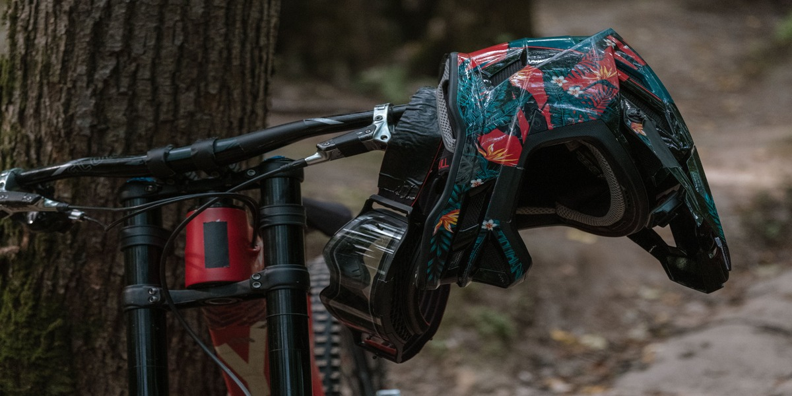

# Mountain bikes and Code: Making the Best Decisions to Become Senior
**It's much closer than you think**

I believe this will be the most fun article I’ve ever written. Before I start comparing the two, I want to grab your attention for just a few moments and explain a bit more about the world of MTB (Mountain Biking). The standard definition is: ‘Mountain Bike is a bicycle designed for off-road cycling’. Mountain bikes share some similarities with other bicycles, but incorporate features designed to enhance durability and performance in rough terrain, which makes them heavier, more complex and less efficient on smooth surfaces. 

Basically, the most common bike options to start are these two: Full suspension and Hardtail. The main difference is that hardtails only have suspension on the front, while the full ones have suspension on both the front and the frame. The interesting thing is that each one has its own riding patterns.

### MTB world

With a full-suspension bike, you feel more comfortable and confident crossing difficult trails and rough terrains. In contrast, riding a hardtail introduces additional challenges, making navigation through the same trails a bit more demanding. After all, it’s called mountain biking for a reason—there's a degree of difficulty inherent to the activity.

If you’re on a difficult trail with a hardtail, you always have to look for better and cleaner trail lines, as it fails to provide the same level of confidence and smooth ride as a full suspension. What then becomes the bottleneck of riding a hardtail bike? You tend to search for **comfort** in the trails, avoiding rough places and obstacles; and here is where I bring coding into the context

### Coding world

Some days ago, as I listened to an [spaces](https://x.com/jessilyneh/status/1747732017268060207?s=20) discussion on X hosted by [Jess](https://twitter.com/jessilyneh), a way of promoting Learn In Public, the speaker [Sibelius Seraphini](https://twitter.com/sseraphini) said something interesting when asked, “How to evolve from mid-level to senior?” He said:

> **“To learn faster, it's essential to focus on active behaviors. If you want to progress from mid-level to senior, it's beneficial to look at the seniors you admire, or those on your team, and observe everything they do. Why can't you do their job? What do they do that you don't? Are they better writers? More organized? More disciplined? Do they manage teams and the product? Do they interact with clients? Is their communication better? You need to understand everything they are doing and focus on addressing the reasons why you can't achieve that, thus allowing yourself to evolve.**

> **First, seek more responsibilities, try to solve more complex problems, tackle tougher bugs, and become one of the team's go-to experts. Act like a senior first, and then you'll be considered a senior. Only then will you earn the benefits.”**

This is undoubtedly a scenario of someone struggling and making their way through adversity - putting effort, consistency, and endurance. Just like a rider who didn’t choose comfort lines and trails to explore, even on a hardtail bike. In this way, I believe we can conclude that the specific bottleneck that blocks a developer from becoming a senior is also the pursuit of **comfort**, often without them even noticing.

This happens because of their tendency to prefer just the tasks they already know how to do. As a result, they struggle when asked to do something different. Trying things you don’t know is the fastest way to evolve. If you focus solely on the skills you already possess and the area you already master, your progress will be slower, and you may likely become a specialist in the wrong moment. It's not about dictating any rules, but having a broader range of knowledge and skills will never be a negative thing.

### Conclusion

I believe that the main message is to avoid comfort zones. It takes a bit of courage and discipline, and you have to desire that. This way, you will be able to perform at your best, even in scenarios where you are not in full control, by trying new things, whether it's diving into a different programming language or tech tool or facing a scary trail, even on a hardtail bike.

You won’t become a Senior by just learning to do the same things they do, as you’ll probably lack experience and real-world problem-solving skills. **BUT**, if you reach the tier of mastering what they do, you will be just close enough. Although it can take some time, you only need to keep doing it.

In a comparable manner, an experienced rider who learned to cycle on a hardtail, and didn’t choose comfort trails while learning, will undoubtedly become much more skilled than someone who started with a full suspension bike. And that's all, folks.

---

Cover photo  by [Anastasia Shuraeva](https://www.pexels.com/pt-br/@anastasia-shuraeva/), taken with an X-T4.
