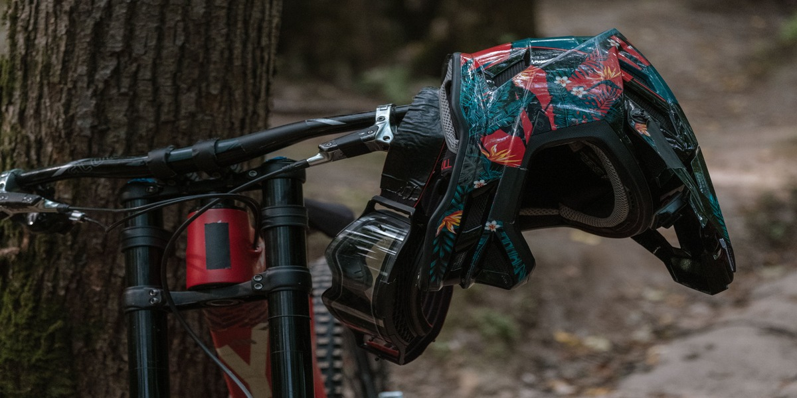

# Mountain bikes and Code: Key Decisions to Senior

I believe this will be the most fun article I’ve ever written, mainly because I’m putting together the two things that I like the most in my life right now: mountain biking and programming. Well, you’re probably wondering where I hit my head to come up with the idea to write this article, but I promise it will make sense. 

Something that I like to do is put together things that I like and things that I want to be good at, making parallels between them. In the same way that we use functions inside other functions and create pointers between them, if you learn something and it’s useful, that skill might help you in other areas of your life too. In a simple manner, it’s about how we evolve and try to get better in every aspect of life.

This time, the chosen ones are mountain bikes and code. Before I start comparing both and saying everything I have in mind, I want to grab your attention for just a few moments and explain a bit more about what defines a mountain bike. After all, what’s the difference between a common bike and a mountain bike? Let me explain this.

### MTB world

The standard definition of an MTB bike is: ‘A mountain bike is a bicycle designed for off-road cycling.’ Basically, it’s a bike meant for trails. Mountain bikes share some similarities with other bicycles, but they incorporate features designed to enhance durability and performance on rough terrain, which makes them heavier, more complex, and less efficient on smooth surfaces.

The most common bike options when someone starts in the world of mountain biking are these two: full suspension bikes and hardtail bikes. The main difference is that hardtails only have suspension on the front, while full suspension bikes have suspension on both the front and the frame. The interesting thing is that each type has its own riding style.

#### Riding patterns: Hardtail and Full-Suspension

When it comes to riding patterns, there’s something important to note: mountain biking is difficult and dangerous. It’s funny, but the truth is that to improve, you need to fall many times on different trails. This way, you'll gain experience and skills. After all, it’s called mountain biking for a reason — there's a degree of difficulty inherent to the sport.

Riding a hardtail means additional challenges because navigating through trails is a bit more demanding, as you only have your arms and the front suspension of the bike. However, with a full-suspension bike, you can avoid some of those struggles, feeling more comfortable and confident when crossing difficult trails and rough terrain.

This means that if you’re on a difficult trail with a hardtail, you always have to look for better and cleaner trail lines, as it fails to provide the same level of confidence and smooth ride as a full suspension bike. It’s common to see people give up, get off the bike, and push it because they think the obstacle is too big. This doesn't happen with a full-suspension bike because you can just go through and run over everything. Literally.

Evolving as a rider with a hardtail bike requires a lot more effort than it does for someone with a full-suspension bike. So, what then becomes the bottleneck of riding a hardtail bike? If you're not giving your best, you tend to search for **comfort** in the trails, avoiding rough places and obstacles. And here is where I bring coding into the context.

### Coding world

A few days ago, there was a <a href="https://x.com/jessilyneh/status/1747732017268060207?s=20" target="_blank">spaces</a> discussion on X, hosted by <a href="https://twitter.com/jessilyneh" target="_blank">Jess</a>, to promote Learn In Public. As I listened to the talk, the main speaker <a href="https://twitter.com/sseraphini" target="_blank">Sibelius</a> said something interesting when asked:

- “How to evolve from mid-level to senior?”

The answer was **perfect** for me. He said:

**“To learn faster, it's essential to focus on active behaviors. If you want to progress from mid-level to senior, it's beneficial to look at the seniors you admire, or those on your team, and observe everything they do.**

**Why can't you do their job? What do they do that you don't? Are they better writers? More organized? More disciplined? Do they manage teams and the product? Do they interact with clients? Is their communication better? You need to understand everything they are doing and focus on addressing the reasons why you can't achieve that, thus allowing yourself to evolve.**

**First, seek more responsibilities, try to solve more complex problems, tackle tougher bugs, and become one of the team's go-to experts. Act like a senior first, and then you'll be considered a senior. Only then will you earn the benefits.”**

 This got me thinking about how this is undoubtedly a scenario of someone struggling and making their way through adversity — putting in effort, consistency, and avoiding comfort. Just like a rider who doesn’t choose comfortable lines and trails to explore, even on a hardtail bike.

In this way, I believe we can conclude that we have a specific bottleneck in common — the one that blocks a developer from becoming a senior is the same as what prevents a hardtail rider from evolving: **comfort**.

In the context of software engineering, I think this happens because juniors and some mid-level developers tend to prefer tasks they already know how to do. This often occurs without them even noticing. As a result, they struggle when asked to do something different. I have seen people refusing to complete a coding challenge for a job offer simply because it wasn’t in the programming language they preferred.

Trying things you don’t know is the fastest way to evolve. To progress, you need to take risks. If you focus solely on the skills you already possess and the tasks you have already mastered, your progress will be slower, and you might end up stuck in the same place forever.

### Conclusion

To wrap things up, I believe that the main message is to avoid comfort zones. It takes a bit of courage and discipline, and you need to have the desire to push beyond them. Your mentor can’t make you a Senior; they can’t code for you or take risks for you. In the end, the responsibility is yours — **only you can do the work**. To evolve, **the rule is the same**.

In this way, you will be able to perform at your best, even in scenarios where you are not in full control, by trying new things, whether it’s diving into a different programming language or new project. You need to face it — just like a rider faces a scary trail, you must confront the challenges of your journey.

---

Cover photo  by [Anastasia Shuraeva](https://www.pexels.com/pt-br/@anastasia-shuraeva/), taken with an X-T4.
