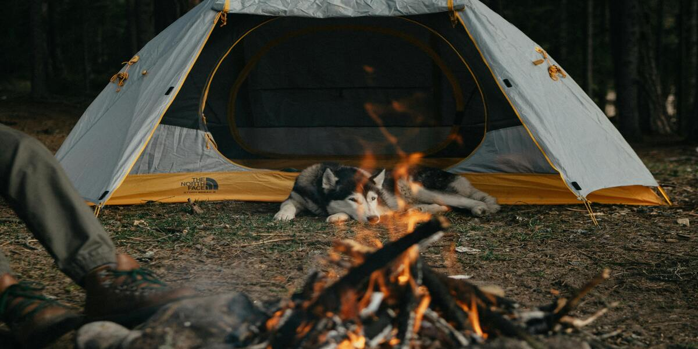

# Courage

**_Rest here weary traveler, for great adventures lie ahead_**

Life always presents us with unexpected things that catch us off guard, and being able to react positively when this happens takes a lot of strength and, most importantly, courage. Courage is what differs the one who stayed on the couch from the one who got up and went for a run. It rescues you from your comfort zone and takes away your fear of trying new things and taking risks. Courage makes your nerves tingle even when everything seems okay on the surface, but deep inside, it is not. It's the last barrier that prevents you from giving up, even when everything seems hopeless. It’s the last glimpse of energy that whispers in your head: try again. And then you go.

In the last few days, I’ve been hit with a ton of uncertainty because I don’t know where my path will lead me. I spent a year in an internship that didn’t meet my expectations, to the point that I even prefer to leave it off my resume because I know it won’t be helpful. My experience there didn’t make me happy, and I felt disappointed with my progress. I spent an entire year in my comfort zone, and that’s entirely my fault. If I had had the necessary courage, I would have left as soon as possible and searched for a better job earlier. Time didn’t stop or wait for me, and now I have to look for a junior position, even though I feel unprepared, or try to find another internship in a better place. Nonetheless, I need to do this while being in the last semester of college, which makes everything harder to accomplish.

But why am I talking about all of this? As someone who’s been struggling with depression for about three years, I've realized that taking action is key to winning this war. You can't stop moving forward. The closer you get to being stuck, the more darkness will grow in your thoughts. Having the courage to face this can save you from hitting rock bottom. If I had been more self-aware of what was happening to me, I could be in a better place right now, without so much fear, urgency, and uncertainty. What doesn’t change, no matter what, is that I need to work hard and smart. I need to move on.

This is the most personal post I’ve ever written and probably the last one, as I plan to focus on more technical articles going forward. I don’t see everything I wrote here as vulnerability or fragility, quite the opposite, I see this as an act of courage. Being able to open up during hard times, instead of just avoiding everything and distancing yourself from people, is an act of strength. Right here, right now, I’m creating an important checkpoint on my journey, a **bonfire** — one that, whenever something goes wrong, I will look back on and remember: have courage, be brave. One more time.

---

Cover photo  by [Igor Cibulsky](https://www.pexels.com/pt-br/@igor-cibulsky-75306089/), taken with an Canon EOS 6D.